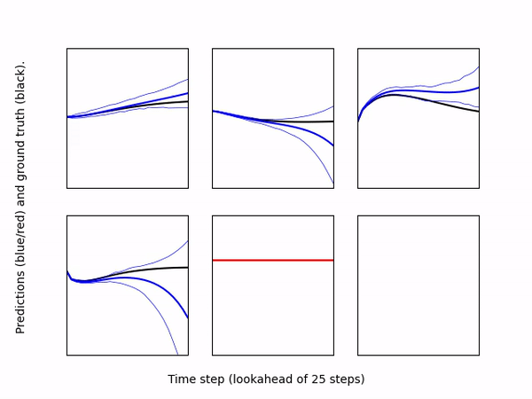
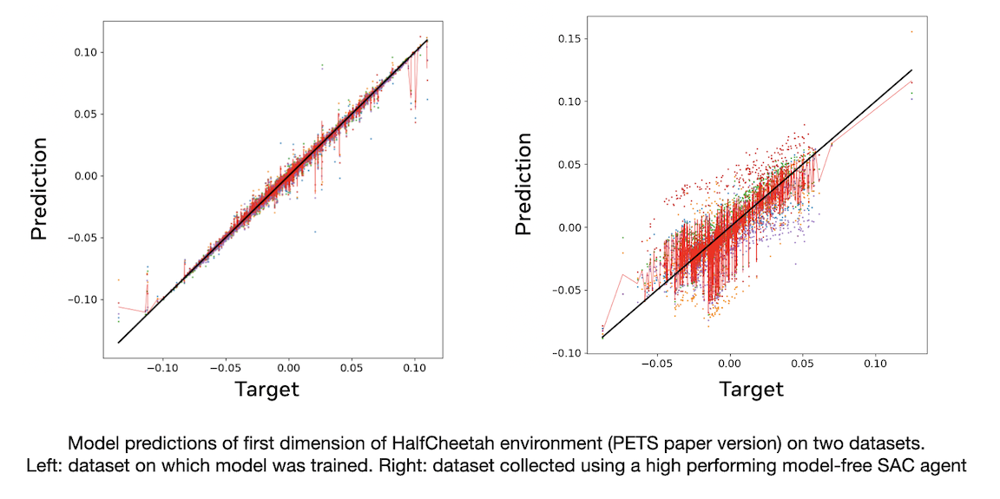

[](https://github.com/facebookresearch/mbrl-lib/actions?query=workflow%3ACI)
[](https://github.com/facebookresearch/mbrl-lib/tree/master/LICENSE)
[](https://www.python.org/downloads/release/python-360/)
[](https://github.com/psf/black)
 

# MBRL-Lib

``mbrl-lib`` is a toolbox for facilitating development of 
Model-Based Reinforcement Learning algorithms. It provides easily interchangeable 
modeling and planning components, and a set of utility functions that allow writing
model-based RL algorithms with only a few lines of code. 

## Getting Started

### Installation

``mbrl-lib`` is a Python 3.7+ library. To install it, clone the repository,

    git clone https://github.com/facebookresearch/mbrl-lib.git

then run

    cd mbrl-lib
    pip install -e .

If you are interested in contributing, please install the developer tools as well

    pip install -e ".[dev]"

Finally, make sure your Python environment has
[PyTorch (>= 1.7)](https://pytorch.org) installed with the appropriate 
CUDA configuration for your system.

For testing your installation, run

    python -m pytest tests/core
    python -m pytest tests/algorithms

### Mujoco

Mujoco is a popular library for testing RL methods. Installing Mujoco is not
required to use most of the components and utilities in MBRL-Lib, but if you 
have a working Mujoco installation (and license) and want to test MBRL-Lib 
on it, please run

    pip install -r requirements/mujoco.txt

and to test our mujoco-related utilities, run

    python -m pytest tests/mujoco

### Basic example
As a starting point, check out our [tutorial notebook](notebooks/pets_example.ipynb) 
on how to write the PETS algorithm 
([Chua et al., NeurIPS 2018](https://arxiv.org/pdf/1805.12114.pdf)) 
using our toolbox, and running it on a continuous version of the cartpole 
environment.

## Provided algorithm implementations
MBRL-Lib provides implementations of popular MBRL algorithms 
as examples of how to use this library. You can find them in the 
[mbrl/algorithms](mbrl/algorithms) folder. Currently, we have implemented
[PETS](mbrl/algorithms/pets.py) and [MBPO](mbrl/algorithms/mbpo.py), and
we plan to keep increasing this list in the near future.

The implementations rely on [Hydra](https://github.com/facebookresearch/hydra) 
to handle configuration. You can see the configuration files in 
[this](conf) folder. The [overrides](conf/overrides) subfolder contains
environment specific configurations for each environment, overriding the 
default configurations with the best hyperparameter values we have found so far 
for each combination of algorithm and environment. You can run training
by passing the desired override option via command line. 
For example, to run MBPO on the gym version of HalfCheetah, you should call
```python
python main.py algorithm=mbpo overrides=mbpo_halfcheetah 
```
By default, all algorithms will save results in a csv file called `results.csv`,
inside a folder whose path looks like 
`./exp/mbpo/default/gym___HalfCheetah-v2/yyyy.mm.dd/hhmmss`; 
you can change the root directory (`./exp`) by passing 
`root_dir=path-to-your-dir`, and the experiment sub-folder (`default`) by
passing `experiment=your-name`. The logger will also save a file called 
`model_train.csv` with training information for the dynamics model.

Beyond the override defaults, You can also change other configuration options, 
such as the type of dynamics model 
(e.g., `dynamics_model=basic_ensemble`), or the number of models in the ensemble 
(e.g., `dynamics_model.model.ensemble_size=some-number`). To learn more about
all the available options, take a look at the provided 
[configuration files](conf). 

Note that running the provided examples and `main.py` requires Mujoco, but
you can try out the library components (and algorithms) on other environments 
by creating your own entry script and Hydra configuration.

## Visualization tools
Our library also contains a set of 
[visualization](mbrl/diagnostics) tools, meant to facilitate diagnostics and 
development of models and controllers. These currently require Mujoco installation, but we are 
planning to add more support and extensions in the future. Currently, 
the following tools are provided:

* [``Visualizer``](visualize_model_preds.py): Creates a video to qualitatively
assess model predictions over a rolling horizon. Specifically, it runs a 
  user specified policy in a given environment, and at each time step, computes
  the model's predicted observation/rewards over a lookahead horizon for the 
  same policy. The predictions are plotted as line plots, one for each 
  observation dimension (blue lines) and reward (red line), along with the 
  result of applying the same policy to the real environment (black lines). 
  The model's uncertainty is visualized by plotting lines the maximum and 
  minimum predictions at each time step. The model and policy are specified 
  by passing directories containing configuration files for each; they can 
  be trained independently. The following gif shows an example of 200 steps 
  of pre-trained MBPO policy on Inverted Pendulum environment.
  
  
  
* [``DatasetEvaluator``](eval_model_on_dataset.py): Loads a pre-trained model
and a dataset (can be loaded from separate directories), and computes 
  predictions of the model for each output dimension. The evaluator then
  creates a scatter plot for each dimension comparing the ground truth output 
  vs. the model's prediction. If the model is an ensemble, the plot shows the
  mean prediction as well as the individual predictions of each ensemble member.
  
  

* [``FineTuner``](finetune_model_with_controller.py): Can be used to train a
model on a dataset produced by a given agent/controller. The model and agent
  can be loaded from separate directories, and the fine tuner will roll the 
  environment for some number of steps using actions obtained from the 
  controller. The final model and dataset will then be saved under directory
  "model_dir/diagnostics/subdir", where `subdir` is provided by the user.
  
* [``True Dynamics Multi-CPU Controller``](control_env.py): This script can run
a trajectory optimizer agent on the true environment using Python's 
  multiprocessing. Each environment runs in its own CPU, which can significantly
  speed up costly sampling algorithm such as CEM. The controller will also save
  a video if the ``render`` argument is passed. Below is an example on 
  HalfCheetah-v2 using CEM for trajectory optimization.
  
  

Note that the tools above require Mujoco installation, and are specific to 
models of type [``OneDimTransitionRewardModel``](../models/one_dim_tr_model.py).
We are planning to extend this in the future; if you have useful suggestions
don't hesitate to raise an issue or submit a pull request!

## Documentation 
Please check out our **[documentation](https://facebookresearch.github.io/mbrl-lib/)** 
and don't hesitate to raise issues or contribute if anything is unclear!

## License
`mbrl-lib` is released under the MIT license. See [LICENSE](LICENSE) for 
additional details about it. See also our 
[Terms of Use](https://opensource.facebook.com/legal/terms) and 
[Privacy Policy](https://opensource.facebook.com/legal/privacy).

## Citing
If you use this project in your research, please cite:

```BibTeX
@Article{Pineda2021MBRL,
  author  = {Luis Pineda and Brandon Amos and Amy Zhang and Nathan O. Lambert and Roberto Calandra},
  journal = {Arxiv},
  title   = {MBRL-Lib: A Modular Library for Model-based Reinforcement Learning},
  year    = {2021},
  url     = {https://arxiv.org/abs/2104.10159},
}
```
